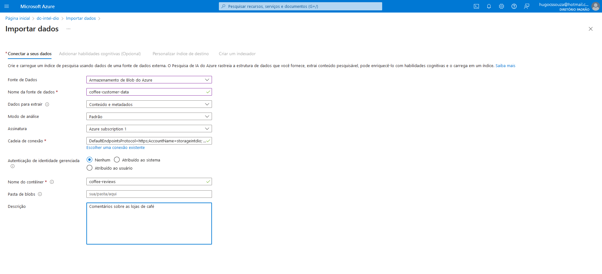

# Guia de utilização do Document Intelligente dentro do ambiente Azure

Caso seja sua primeira interação com o ambiente Azure, recomendo visitar primeiro [este repositório](https://github.com/HugoCSouza/inicio-azure), que indica os passos iniciais de configuração de um ambiente Azure.

## Criação de recursos

Para começar a utilizar o AI Search, assim como em qualquer aplicação do Azure, devemos criar um recurso. Na seção de criação de recursos, procure pelo recurso "*Azure AI Services*".

Dentro deste tipo de IA, procure por "*AI Search*" e selecione esta aplicação.

Na aba de criação deste recurso, selecione o grupo, dê um nome individual para ele e modifique a opção de camada de preços para *Basic*.

**Observação:** Não se preocupe com a cobrança, você pode excluir este recurso imediatamente após seguir este guia de aprendizado.

Após esses passos, selecione "Revisar + criar", aguarde a validação e crie o recurso. Em seguida, retorne à aba "*Azure AI Services*" e crie um recurso "*Document Intelligence*".

Configure este recurso com o tipo de preço F0. Após isso, vamos criar manualmente uma conta de armazenamento. Na criação de recursos, clique em "Armazenamento" e, em seguida, em "Conta de Armazenamento".

Selecione o desempenho como *Standard* e a redundância como *LRS*. Após isso, você pode criar a conta.

Aguarde alguns segundos para que sua conta de armazenamento seja criada e clique em "Ir para o recurso". Dentro da aba da conta de armazenamento, no menu lateral esquerdo, role a tela até aparecer a aba *Settings* (ou configurações) e clique em *Configuration* (ou configuração).

Dentro dessa aba, na opção "Permitir acesso anônimo de Blob", selecione habilitar e salve a configuração.

Então, role o menu lateral até a parte superior, na aba "Armazenamento de dados" e clique em "Containers". Dentro dessa opção, selecione criar um container clicando no símbolo "+".

Coloque o nome "coffee-reviews" e mude o nivel de acesso para contêiner conforme a imagem.

Baixe o [arquivo zip](https://aka.ms/mslearn-coffee-reviews) que contém a documentação de teste e extraia-o em seu dispositivo. Em seguida, clique em "Upload" (ou Carregar) e faça o upload de todos os arquivos para dentro do container que você acabou de criar.

Após esta etapa, você retorna no recurso *AI Search* criado e selecione a opção importar dados.

Na etapa de escolher os dados, siga as seguintes configurações:

- **Fonte de Dados:** Armazenamento de Blob do Azure
- **Nome da fonte de dados:** coffee-customer-data
- **Dados para extrair:** Conteúdos e metadados
- **Modo de análise:** Padrão
- **Assinatura:** A que você estiver utilizando
- **Cadeia de conexão:** Selecione a opção "Escolher uma conexão existente", escolha sua conta de armazenamento e o container "coffee-reviews".
- **Autenticação de identidade gerenciada:** Nenhum
- **Nome do contêiner:** Esta configuração será preenchida automaticamente
- **Pasta de blobs:** Deixe este campo em branco
- **Descrição:** Comentários sobre as lojas de café

Clique em "Ir para: Adicionar habilidades cognitivas".

Nesta aba, expanda a opção "Adicionar enriquecimentos" e configure da seguinte forma:

- **Nome do conjunto de habilidades:** coffee-skillset
- Selecione a caixa "Habilitar OCR e mesclar todo o texto no campo merged-content"
- **Campo de dados de origem:** merged_content
- **Nível de granularidade do enriquecimento:** Páginas (partes de caracteres de 5000)
- Não selecione a caixa "Habilitar o enriquecimento incremental"
- Selecione os campos: Extrair nome de localização, extrair frases-chave, detectar sentimento, gerar marcações de imagens e gerar legendas de imagens

Na opção "Salvar os enriquecimentos em um repositório de conhecimento", selecione todas as opções.

Caso apareça esse aviso, siga os seguintes passos:

- Clique em "Escolher uma conexão existente".
- Selecione a conta de armazenamento já criada.
- Clique em "+" para criar um container.
- Insira o nome de "knowledge-store" com o nível de privacidade privado, crie e selecione este container.

Na aba "Personalizar índice de destino", siga estes passos:

- **Nome do índice:** coffee-index.
- **Chave:** metadata_storage_path
- **Nome do sugestor:** Deixe em branco
- **Modo de busca:** Deixe padrão
- Selecione "Filtrável" em todos os campos já selecionados.

Então, pode-se partir para a próxima etapa.

Na parte do indexador, insira:

- **Nome do indexador:** coffee-indexer
- **Agenda:** Uma vez
- **Descrição:** (Opcional)
Expanda as opções avançadas e selecione:

- Chaves de Codificação de Base 64

Após isso, clique em enviar.
